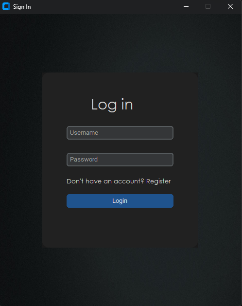
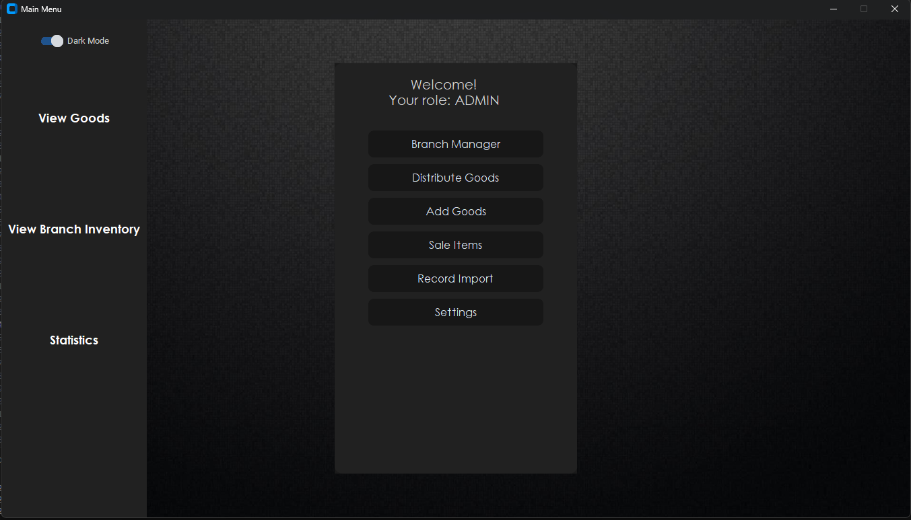
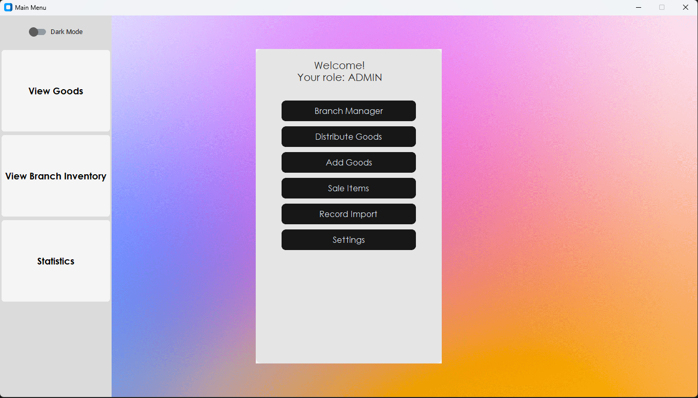
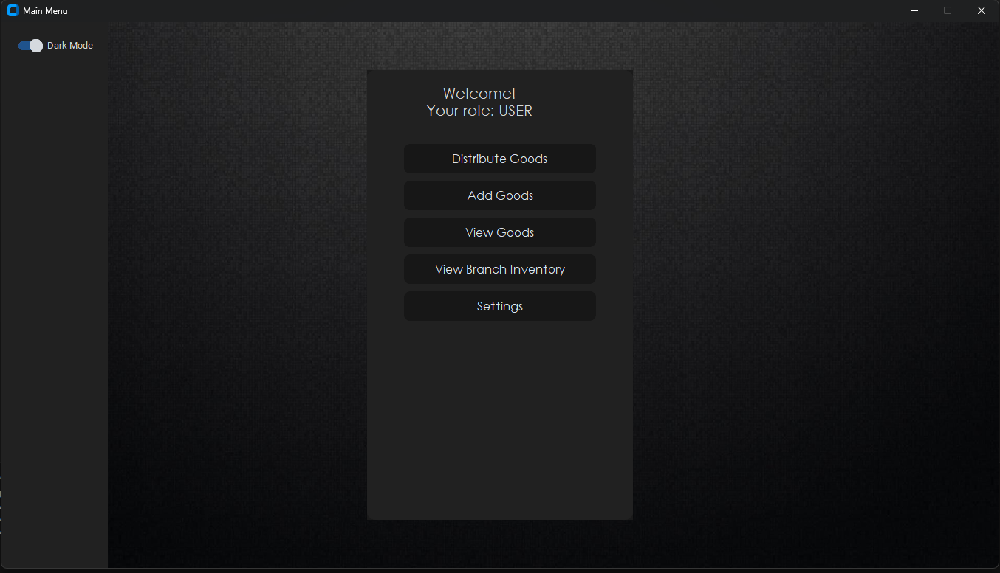
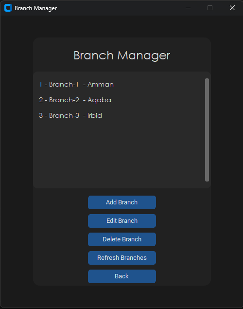
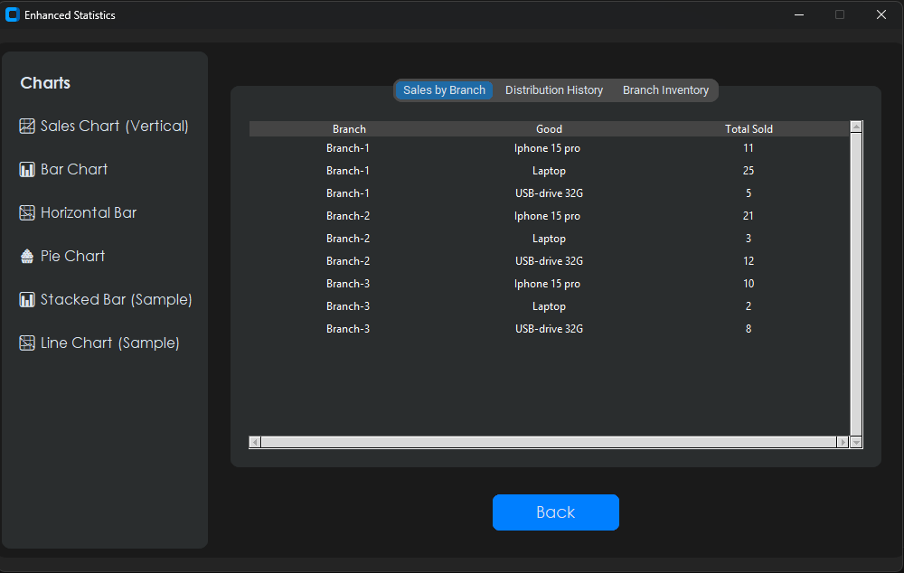
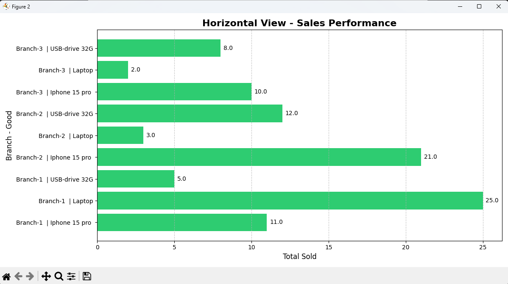
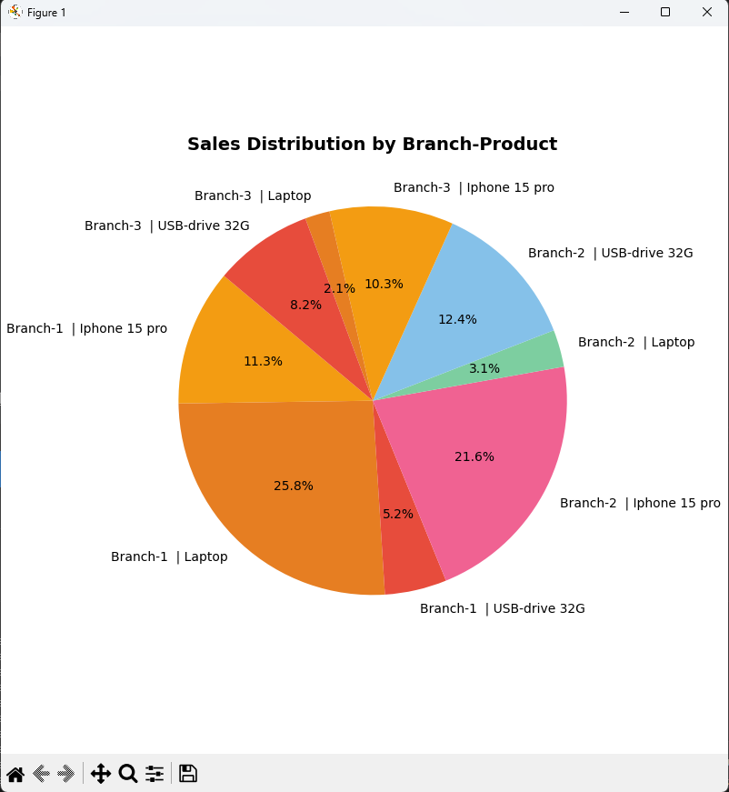

 # 🏪 Goods Distribution System

A full-featured, secure, and visually enhanced inventory and distribution management system built with **Python**, **SQLite**, and **CustomTkinter**. Designed for warehouse and branch operations, it supports goods tracking, secure role-based access, graphical statistics, and real-time inventory control.


# ScreenShot

- Login

- Main_menu -Darkmode

- Main_menu -lightmode

- Main_menu User>>Role

- Branch_manager

- Statistics_Screen

- Charts 




---

## 📦 Features

### 🔐 Authentication & Role Management
- User login and registration (bcrypt password hashing)
- Admin and Staff roles
- Attempt limit with lockout behavior
- Admins can add, delete, or promote users

### 🧾 Goods Management
- Add new goods with quantity and price
- View and manage existing goods (edit/delete)
- Quantity validation and real-time updates

### 🏬 Branch Management
- Add, edit, and delete branch records
- Inventory per branch managed independently

### 🔁 Goods Distribution
- Distribute goods from warehouse or between branches
- Real-time stock checking before transactions
- Automatically updates inventory and logs distribution history

### 💰 Sales Recording
- Record sales per branch with quantity validation
- Calculates earnings and deducts sold quantity
- Helps in monitoring branch performance

### 📊 Statistics & Charts
- Sales by branch and product
- Distribution history tracking
- Inventory overview
- Interactive charts (bar, pie, line, stacked)

### 🛠 Settings & User Management
- Admin-only access to user list
- Add/delete users with role assignment
- Change password for users and admins

---

## 🖼 UI Highlights

- **Modern dark/light themes** using `CustomTkinter`
- Responsive layout with scrollable views
- Background image support for better aesthetics
- Sidebar navigation with categorized views


---

## 🛠 Requirements

- Python 3.11+
- [CustomTkinter](https://github.com/TomSchimansky/CustomTkinter)
- Pillow (for image support)
- bcrypt
- matplotlib

Install dependencies:
```bash
    pip install customtkinter pillow bcrypt matplotlib
```

---
### Getting Started

    Clone the repository:

        git clone https://github.com/your-username/goods-distribution-system.git

    Run the app:

        python main.py

    Register a user (e.g., jamal), then use the DB update script to promote to Admin:

# promote_admin.py
# Sets 'jamal' as an admin with default password 'jamal1234'

📌 Notes

    Admins have full control over branches, users, and inventory.

    Users can only view and operate within the assigned roles.

    System is fully local, no internet connection required.

    All data is stored securely in goods_system.db.

🧠 Future Enhancements

- PDF export for reports

- Cloud database support

- Email alerts on low stock

- Activity log viewer

👨‍💻 Author

- Jamal Alqbail

Security & Network Specialist | Python Developer
